<div align="center">




<br/>
<br/>


</div>

---

### 🎯 What is this?

A **hands-on interactive checklist** for systematically finding **Cross-Site Scripting (XSS)** vulnerabilities in web applications. No theory overload — just a clear, step-by-step workflow you can follow in DevTools.

[](https://red4beard.github.io/xss-trainer/)

---

### 🛡️ What's inside

| Step | Type | What you check |
|:---:|:---|:---|
| 00 | `Setup` | Environment preparation — DevTools, Incognito, cache |
| 01 | `Reflected` | Reflection marker test — does input come back in the response? |
| 02 | `Reflected` | Escaping check — do special characters pass through? |
| 03 | `Reflected` | Attribute break-out — can a quote escape an HTML attribute? |
| 04 | `DOM-based` | innerHTML sink diagnosis via runtime hook |
| 05 | `DOM-based` | insertAdjacentHTML sink detection |
| 06 | `DOM-based` | URL / location as source — hash & search params |
| 07 | `DOM-based` | localStorage as source — stored client data |
| 08 | `Stored` | Stored XSS via network — persistent server-side data |
| 09 | `Stored` | JSON / API response — user data in server responses |
| 10 | `Reflected` | Cookie injection via proxy (Charles / Burp Suite) |
| 11 | `Defense` | CSP header check — real protection or illusion? |
| 12 | `DOM-based` | Dangerous patterns in source code |

---

### 🚀 Features

- 🔲 **Interactive checklists** — track your progress step by step
- 📋 **One-click copy** — all code snippets ready to paste into Console
- 💾 **Persistent progress** — saved in localStorage, survives browser restart
- 📊 **Coverage dashboard** — Reflected / Stored / DOM stats at a glance
- 🧭 **Sidebar navigation** — jump to any step instantly
- 🖤 **Dark hacker UI** — terminal-style design, zero distractions
- 📱 **Responsive** — works on mobile too
- ⚡ **Zero dependencies** — single HTML file, no frameworks, no build step

---

### 🔗 Attack Chain

```
Source → Transport → Storage → Render → Execution
```

> **Break any link = no XSS.** The trainer walks you through each link systematically.

---

### 📦 Usage

**Option A** — use the hosted version:
👉 [**red4beard.github.io/xss-trainer**](https://red4beard.github.io/xss-trainer/)

**Option B** — run locally:
```bash
git clone https://github.com/Red4beard/xss-trainer.git
open xss-trainer/index.html
```

No server needed. Just open the HTML file in any browser.

---

### 🛠️ Built with

<div align="center">


</div>

---

### ⚠️ Disclaimer

This tool is intended for **educational purposes** and **authorized security testing only**. Always obtain proper authorization before testing any web application for vulnerabilities. The author is not responsible for any misuse.

---

### 📄 License

MIT — free to use, modify, and distribute.

---

<div align="center">

**If you find this useful, please ⭐ the repo — it helps others discover it!**

</div>
